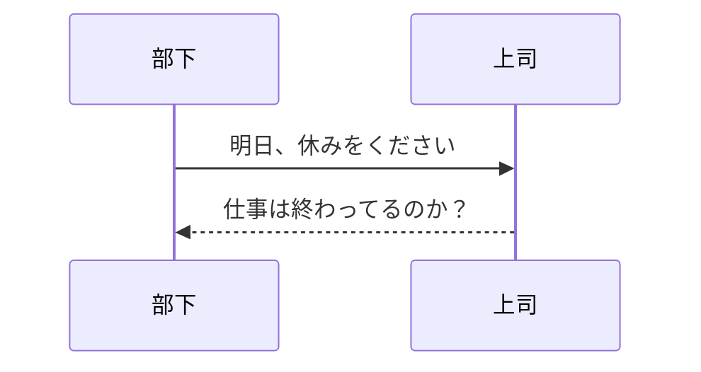
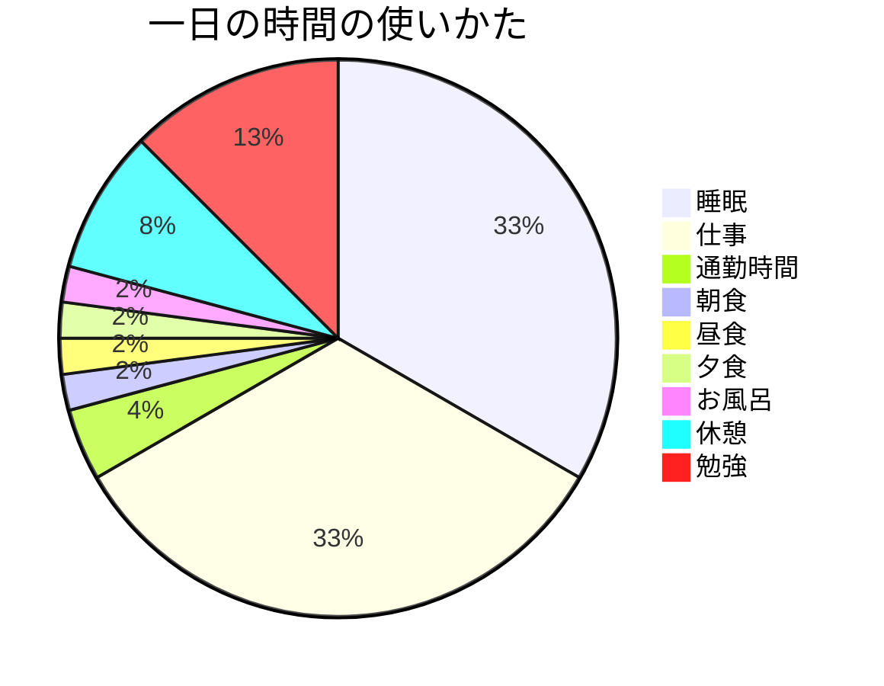
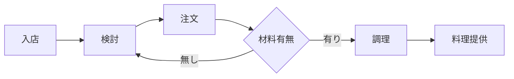

# mermaidで記述できるダイアグラムの記述例とコード
## シーケンス図
```
sequenceDiagram
    部下->>上司: 明日、休みをください
    %% this is a comment
    上司-->>部下: 仕事は終わってるのか？
```

## 円グラフ
```
pie
    title 一日の時間の使いかた
    "睡眠" : 8
    "仕事" : 8
    "通勤時間" : 1
    "朝食" : 0.5
    "昼食" : 0.5
    "夕食" : 0.5
    "お風呂" :  0.5
    "休憩" :  2
    "勉強" :  3
```

## フローチャート
```
    graph LR;
        enter[入店];
        consider[検討];
        order[注文];
        confirm{材料有無};
        cook[調理];
        serve[料理提供];
        enter --> consider;
        consider --> order;
        order --> confirm;
        confirm -- 無し --> consider;
        confirm -- 有り --> cook;
        cook --> serve;
```



***
引用元１ https://usefuledge.com/vscodemermaidsupport.html
引用元２ https://www.engineer-route.com/column/8973/
