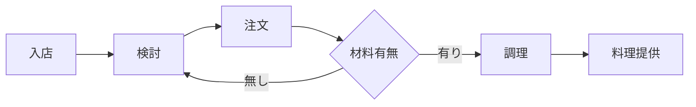

# mermaidで記述できるダイアグラムのチュートリアル
## フローチャートの作り方
1. テキストエディタを開くか、Markdownをサポートするオンラインエディタを使います。例えば、Typora（https://typora.io/）やVisual Studio Code（https://code.visualstudio.com/）などがあります。
2. Mermaidのコードブロックを作成します。Mermaidのコードは、三連バッククォート（```）で囲みます。
3. フローチャートの要素を定義します。要素はノード（Node）として表されます。ノードは[ ]で囲み、その中にテキストを記述します。
4. ノード同士を矢印（-->）で接続して、フローチャートの流れを表現します。矢印はノードの名前を使って接続します。
5. 必要に応じて条件分岐などのロジックを追加することができます。条件分岐は中括弧（{ }）と-- 条件 -->を使用して表現します。
6. Mermaidコードをプレビューしてフローチャートが正しく表示されることを確認します。
チュートリアルのサンプルを具体的に示します：




このコードは、入店から料理提供までの料理店のサービスプロセスを表すフローチャートを作成します。Mermaidのコードをサポートしているエディタで上記のコードを貼り付けると、フローチャートが表示されるはずです。

上記のチュートリアルを参考にして、自分のフローチャートを作成してみましょう。


